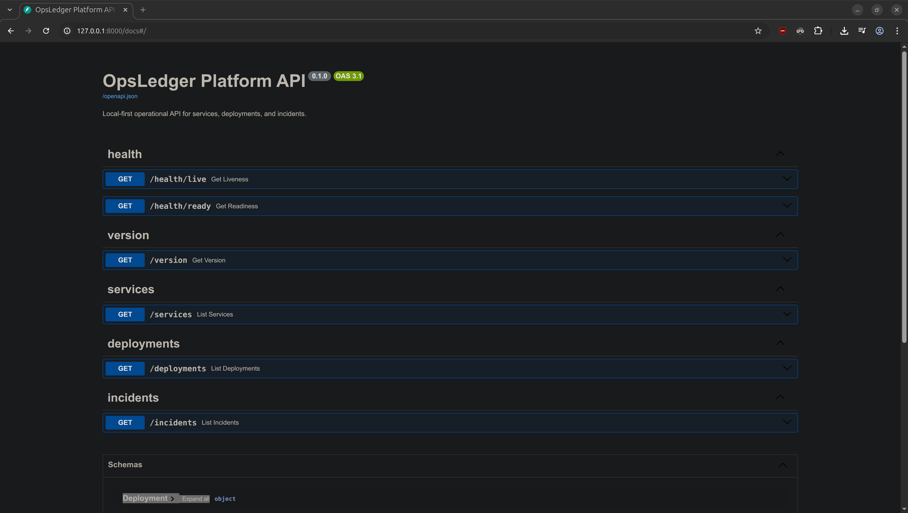
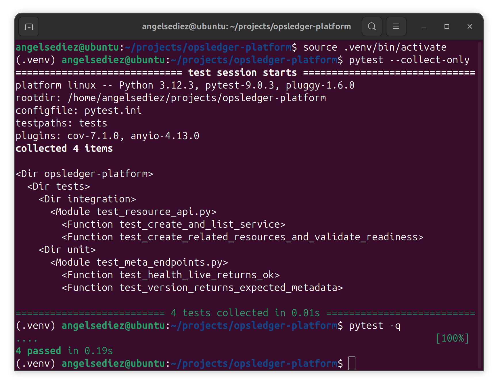
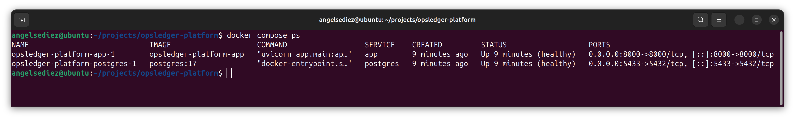
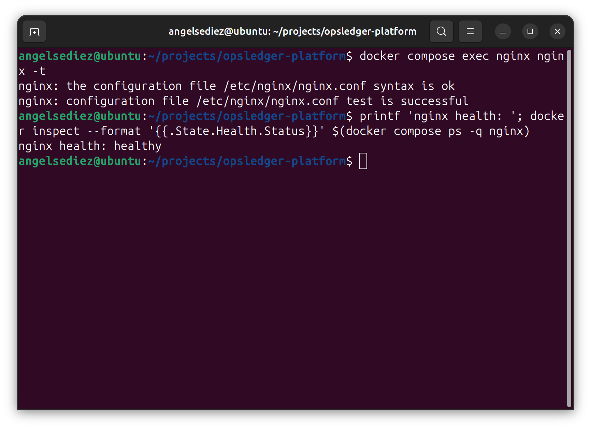
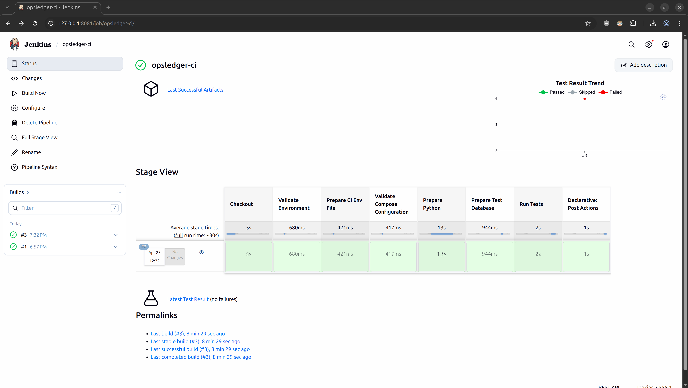
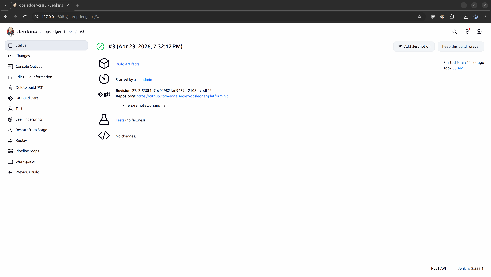
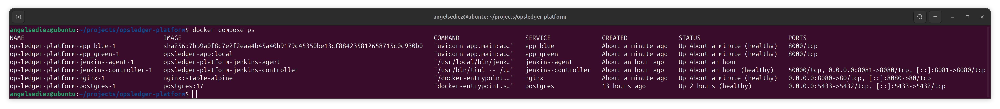
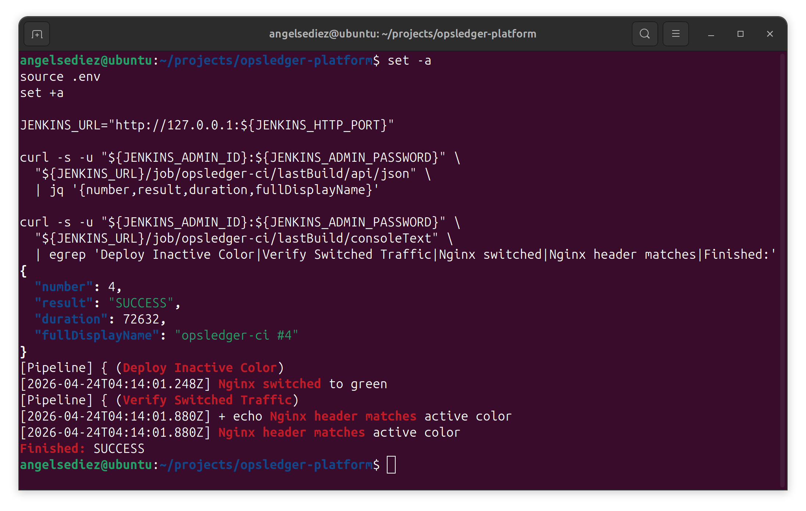
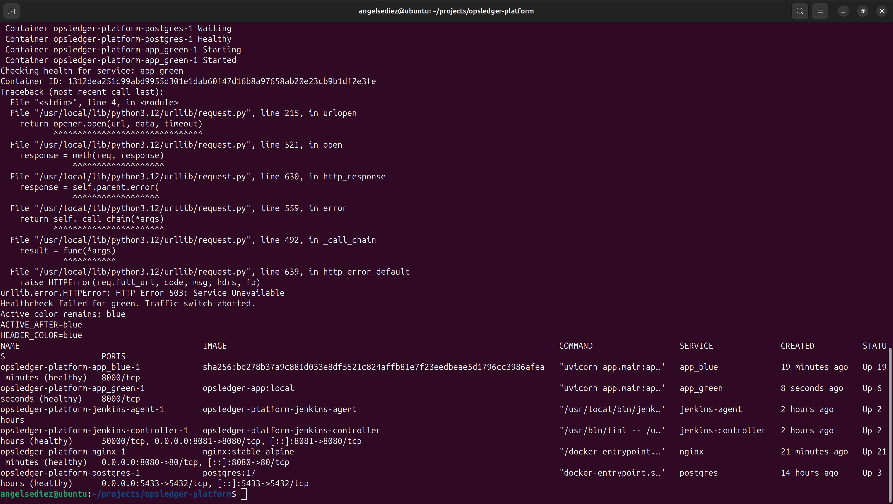
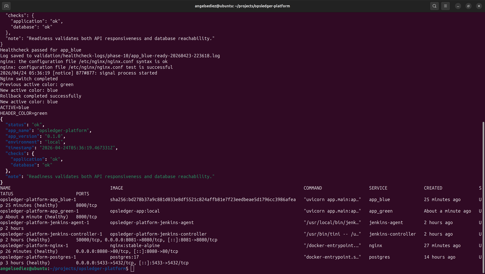

<div align="center">

# ⚙️ OpsLedger Platform

### Local-first DevOps/SRE homelab for practicing CI/CD, reverse proxying, blue/green deployment, rollback, and failure simulation


</div>

---

## 📌 Overview

**OpsLedger Platform** is a production-style local DevOps/SRE homelab built around a small internal API. The app is intentionally minimal, but the delivery and operations model is deliberately operationally rich.

The purpose of this lab is to practice, study, and validate platform engineering workflows in a reproducible local environment:

- API runtime with FastAPI
- PostgreSQL persistence
- Alembic migrations
- pytest unit/integration testing
- Docker image build and Docker Compose orchestration
- Nginx reverse proxy entrypoint
- Jenkins controller/agent CI/CD
- Pipeline as Code with `Jenkinsfile`
- local blue/green deployment
- readiness healthcheck gate before traffic switch
- manual rollback
- controlled deploy-failure simulation
- runbooks, troubleshooting, screenshots, and validation evidence

> [!IMPORTANT]
> **Lab State:** Complete v1 local baseline.  
> **Final Baseline:** Phase 10 — rollback hardening, deploy-failure simulation, runbooks, troubleshooting, and validation evidence.

---

## 🎯 Learning Focus

This lab was built to practice and document how a small service behaves when it is operated like a production workload. The emphasis is on hands-on validation, failure handling, and repeatable operational procedures rather than application feature volume.

Core learning areas:

- containerized service runtime design
- database-backed API operation
- CI pipeline execution on a separate agent
- reverse proxy traffic management
- blue/green deployment mechanics
- readiness-gated release safety
- manual rollback and deploy-failure recovery
- evidence-based documentation and troubleshooting

---

## 🧭 Architecture at a Glance

```text
Application runtime

host -> nginx -> app_blue | app_green -> postgres
```

```text
CI/CD runtime

jenkins-controller -> jenkins-agent -> host-mounted CI workspace -> Docker Compose / pytest / blue-green scripts
```

| Domain | Components | Purpose |
| :--- | :--- | :--- |
| API runtime | `app_blue`, `app_green` | FastAPI service variants for blue/green switching |
| Data layer | `postgres` | Persistent PostgreSQL database with Alembic migrations |
| Entrypoint | `nginx` | Public reverse proxy and active-color traffic switch |
| CI control plane | `jenkins-controller` | Jenkins orchestration only, configured with `0` executors |
| CI execution | `jenkins-agent` | Docker-capable static agent that runs builds and deployment scripts |
| Operations | `scripts/`, `runbooks/`, `troubleshooting/` | Deployment, rollback, recovery, and incident guidance |

---

## 🧰 Technical Stack

### Application and Data


### Platform and Delivery


---

## ✅ Completed Baseline

| Phase | Scope | Status |
| :--- | :--- | :---: |
| Phase 00 | Host baseline and Docker installation validated | ✅ |
| Phase 01 | Repository structure and base documentation | ✅ |
| Phase 02 | Minimal FastAPI app and operational endpoints | ✅ |
| Phase 03 | PostgreSQL, SQLAlchemy, and Alembic integration | ✅ |
| Phase 04 | pytest unit and integration testing baseline | ✅ |
| Phase 05 | Dockerfile and Docker Compose app stack | ✅ |
| Phase 06 | Nginx reverse proxy in front of the API | ✅ |
| Phase 07 | Jenkins controller + static Docker-capable agent | ✅ |
| Phase 08 | Jenkins Pipeline as Code with real CI | ✅ |
| Phase 09 | Local blue/green deployment and Nginx switch | ✅ |
| Phase 10 | Rollback hardening, deploy-failure simulation, runbooks, and evidence | ✅ |

---

## 🖼️ Evidence Gallery

### 🚀 API and Testing Baseline

| FastAPI docs | pytest and coverage |
| :---: | :---: |
|  |  |

### 🐳 Compose and Nginx Runtime

| Compose services | Nginx config and health |
| :---: | :---: |
|  |  |

### 🧪 Jenkins CI/CD

| Jenkins pipeline success | Test results and artifacts |
| :---: | :---: |
|  |  |

### 🔁 Blue/Green Deployment and Rollback

| Blue/green services | Jenkins blue/green deploy |
| :---: | :---: |
|  |  |

### 🧯 Failure Simulation and Recovery

| Failed deploy keeps previous color | Manual rollback validation |
| :---: | :---: |
|  |  |

<details>
<summary><strong>More screenshots</strong></summary>

Evidence is organized by phase under:

```text
assets/screenshots/
├── phase-00/
├── phase-01/
├── phase-02/
├── phase-03/
├── phase-04/
├── phase-05/
├── phase-06/
├── phase-07/
├── phase-08/
├── phase-09/
└── phase-10/
```

</details>

---

## 🧪 What This Lab Practices and Validates

| Area | Practiced Capability |
| :--- | :--- |
| API operations | Liveness, readiness, version endpoint, CRUD-style resource endpoints |
| Data operations | PostgreSQL persistence, migrations, test database workflow |
| Testing | pytest unit/integration tests, coverage, JUnit output |
| Containerization | Dockerfile, Compose services, healthchecks, named volumes |
| Reverse proxy | Nginx as public entrypoint, internal app isolation |
| CI/CD | Jenkins controller/agent split, Pipeline as Code, artifacts, test reports |
| Deployment | local blue/green deployment using `app_blue` and `app_green` |
| Release safety | mandatory readiness healthcheck before traffic switch |
| Recovery | manual rollback, failed deploy simulation, runbooks and troubleshooting |

---

## 📂 Repository Map

```text
.
├── app/                    # FastAPI app, routers, models, schemas, db wiring
├── alembic/                # Alembic migration environment and versions
├── docker/                 # App Dockerfile and Nginx config
├── jenkins/                # Jenkins controller, agent, plugins, init scripts
├── scripts/                # Blue/green deploy, switch, healthcheck, rollback
├── tests/                  # Unit and integration tests
├── docs/                   # Architecture, setup guide, CI/CD, ADR index
├── runbooks/               # Operational rollback and deploy-failure runbooks
├── troubleshooting/        # Debugging guides for Nginx, Jenkins, Postgres, common errors
├── assets/screenshots/     # Phase-based visual evidence
├── validation/             # Test results, healthcheck logs, validation artifacts
├── docker-compose.yml
├── Jenkinsfile
├── Makefile
├── requirements.txt
└── requirements-dev.txt
```

---

## 🚀 Run Locally with Docker Compose

### 1. Create local environment file

```bash
cp .env.example .env
```

### 2. Ensure host CI root exists

```bash
mkdir -p /home/angelsediez/jenkins-workspaces
```

### 3. Validate Compose rendering

```bash
docker compose config
```

### 4. Start the app runtime

```bash
docker compose up -d --build --remove-orphans postgres app_blue app_green nginx
```

### 5. Apply migrations

```bash
docker compose exec app_blue alembic upgrade head
docker compose exec app_blue alembic current
```

### 6. Validate services

```bash
docker compose ps
docker compose exec nginx nginx -t
```

### 7. Validate API through Nginx

```bash
set -a
source .env
set +a

curl -s "http://127.0.0.1:${NGINX_PORT}/health/live" | jq
curl -s "http://127.0.0.1:${NGINX_PORT}/health/ready" | jq
curl -s "http://127.0.0.1:${NGINX_PORT}/version" | jq
```

---

## 🔁 Blue/Green Operations

### Check active color

```bash
./scripts/get-active-color.sh
```

### Validate both colors

```bash
./scripts/healthcheck.sh blue
./scripts/healthcheck.sh green
```

### Deploy inactive color and switch traffic

```bash
./scripts/deploy-blue-green.sh
```

### Validate active color header using GET

```bash
set -a
source .env
set +a

HEADER_COLOR="$(curl -fsS -D - -o /dev/null "http://127.0.0.1:${NGINX_PORT}/health/live" \
  | tr -d '\r' \
  | awk -F': ' '/^X-OpsLedger-Active-Color:/{print $2}')"

echo "Nginx header color: ${HEADER_COLOR}"
```

### Simulate a controlled failed deploy

```bash
SIMULATE_FAILURE=true ./scripts/deploy-blue-green.sh || true
```

Expected behavior:

- inactive color fails healthcheck
- traffic switch is aborted
- previous active color remains serving through Nginx

### Manual rollback

```bash
./scripts/rollback.sh
```

or explicitly:

```bash
./scripts/rollback.sh blue
./scripts/rollback.sh green
```

---

## 🧩 Jenkins CI/CD

Jenkins runs with a controller/agent split:

- `jenkins-controller`: orchestration only, `0` executors
- `jenkins-agent`: Docker-capable execution node

The pipeline is defined in:

```text
Jenkinsfile
```

Current pipeline responsibilities:

- checkout from SCM into a host-mounted CI workspace
- validate agent tools
- prepare CI `.env`
- validate Docker Compose config
- create Python virtual environment
- recreate PostgreSQL test database
- run pytest with coverage and JUnit output
- archive test artifacts
- optionally run local blue/green deploy when `RUN_DEPLOY=true`

### Validate last Jenkins build

```bash
set -a
source .env
set +a

curl -s -u "${JENKINS_ADMIN_ID}:${JENKINS_ADMIN_PASSWORD}" \
  "http://127.0.0.1:${JENKINS_HTTP_PORT}/job/opsledger-ci/lastBuild/api/json" \
  | jq '{number,result,building,duration,fullDisplayName}'
```

---

## 🧾 Key Documentation

| Document | Purpose |
| :--- | :--- |
| [`docs/setup-guide.md`](docs/setup-guide.md) | Full local setup, validation, and operation guide |
| [`docs/architecture.md`](docs/architecture.md) | Architecture evolution and final runtime model |
| [`docs/ci-cd-pipeline.md`](docs/ci-cd-pipeline.md) | Jenkins pipeline model and operational boundaries |
| [`docs/decisions.md`](docs/decisions.md) | ADR index |
| [`runbooks/runbook-rollback.md`](runbooks/runbook-rollback.md) | Manual rollback procedure |
| [`runbooks/runbook-incident-deploy-failure.md`](runbooks/runbook-incident-deploy-failure.md) | Deploy-failure incident response |
| [`troubleshooting/nginx-502.md`](troubleshooting/nginx-502.md) | Nginx 502 diagnosis and recovery |
| [`troubleshooting/jenkins-build-fails.md`](troubleshooting/jenkins-build-fails.md) | Jenkins pipeline failure diagnosis |
| [`troubleshooting/common-errors.md`](troubleshooting/common-errors.md) | Common operational errors |

---

## 🧠 Design Decisions

- The app is intentionally small so the focus stays on DevOps/SRE workflow.
- PostgreSQL uses host port `5433` to avoid local `5432` conflicts.
- Nginx is the only public app entrypoint.
- Blue/green uses two Compose services: `app_blue` and `app_green`.
- Readiness healthcheck is mandatory before Nginx traffic switch.
- Rollback is manual, explicit, and traffic-based.
- Jenkins controller does not run builds.
- Jenkins agent mounts Docker socket as a local-lab tradeoff, not a production security pattern.
- CI deployment runs from a host-mounted workspace because Docker bind mounts are resolved by the host daemon.

---

## 🧱 Boundaries and Non-Goals

This is intentionally a **local-first practice homelab**, not a production deployment platform.

Out of scope for v1:

- Kubernetes rollout logic
- cloud deployment
- registry promotion workflow
- canary routing
- weighted traffic shifting
- service mesh
- Terraform infrastructure provisioning
- Prometheus/Grafana observability stack

These are better as future experiments, separate repositories, or a v2, not required work for this baseline.

---

## ✅ Lab Status

> [!IMPORTANT]
> **Status:** Complete ✅  
> **Scope:** Phase 00 through Phase 10 complete.  
> **Lab State:** Completed DevOps/SRE homelab baseline with CI/CD, blue/green deployment, rollback, failure simulation, runbooks, troubleshooting, screenshots, and validation evidence.

---

## 👤 Author

**Angel Diez**
